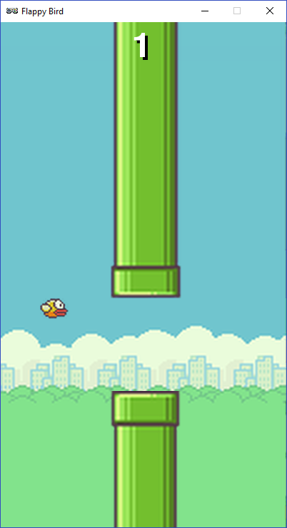

.. pygamezero_bird documentation master file, created by
   sphinx-quickstart on Tue Aug 20 17:51:39 2019.
   You can adapt this file completely to your liking, but it should at least
   contain the root `toctree` directive.

Pygame Zero : Flappy Bird Tutorial
===========================================

https://tinyurl.com/y37qxb5h

Pygame Zero is a wrapper around Pygame, a popular Python game engine.   The advantage of Pygame Zero is that it presents a very simple and streamlined interface, meaning it takes very little work to make complete games.  

The features in Pygame Zero are very similar to those found in Scratch, and are designed for programmers with no experience in text-based coding.  

In this tutorial we'll make a Flappy Bird clone

Getting set up
--------------
See https://codewith.mu/en/download for download links and instructions for installing Mu on your platform.

The Mu installer also installs PyGame and PyGame zero.  

If you have any trouble installing Mu, as a fallback you can download PortaMu from that same page.  You don't need a pen drive as the website suggests,  PortaMu will simply run anywhere without being installed. Just download and unzip on to your desktop.

It is not advised not to run the portable and the fully installed version of Mu on the same system, as they can sometimes interfere and break both installations.

Launching Mu
------------
The first time you start Mu you might be asked which mode you want to work in.  For this project you will be using PyGame Zero. If you already have Mu open in a different mode you can switch using the **mode** button in the top left.

Installing Assets
-----------------
Download the tutorial assets by |location_link|. You can close that page once the download finishes.   Click on the **Images** button in the Mu editor.  This will open the directory where Pygame Zero looks for images.  Copy the images from the **images.zip** file you just downloaded into this directory.

.. |location_link| raw:: html

   <a href="https://kinolien.github.io/gitzip/?download=https://github.com/andyborrell/pygamezero_bird/tree/master/images" target="_blank">clicking this link</a>

Start the Tutorial
------------------

Click on the Part 1 link below to get started.

.. toctree::
   :maxdepth: 2
   
   part1
   part2

