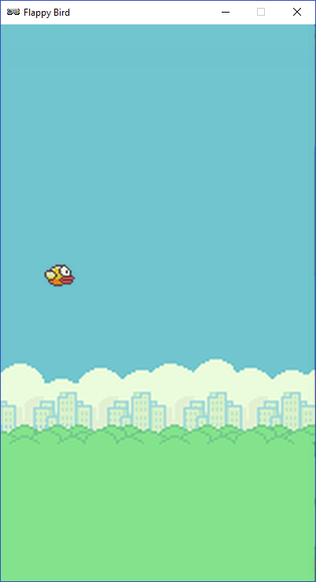

.. _part1:

Part 1
======

Getting Started
---------------

- Press the **New** button in Mu to open a new file and enter the following lines:

.. code:: python

    WIDTH = 400
    HEIGHT = 708
    TITLE = 'Flappy Bird'

- Press **Save** and save the file as flappybird.py

- press **Play** to see what this code does.

You should see an new empty window appear.   

*Can you guess what each line of code does?*

- Press the **Stop** button to end your program.  You have to do this even if you closed the new window.

- Try changing the numbers on each line to try to work out what each line does.  

*How big or small can you make the window?*   

**If you make it too big the window might not appear at all.   If you make it too small you might not be able to find it!  In this case just press the Stop button.**

Drawing a Background
--------------------
- Add these lines to the end of your program.  Make sure you add the spaces at the beginning of the second line.

.. code:: python

    def draw():
        screen.blit('cascade', (0, 0))

The **def** keyword creates a *function*.   A function is a way of grouping instructions together.  The function we just made is called **draw**.  You need to have a **draw** function if you want Pygame Zero to draw anything.  The line that starts with **screen.blit** is the only instruction in this function.  It tells Pygame Zero to draw something on the screen.

- Press **Play**

Let's try changing the background...

- Press **Stop** if the game is playing. Then click on the **Images** button.  

You should see a folder with all the images in this project.  You can use any of these in the game.  You can even add your own images here, either downloaded from online, or created in a paint tool.

- Go back to Mu and change :code:`'cascade'`  to :code:`'background'` to use the background.png image from that directory.  
- Press **Play** to start the game again
- Repeat to find a background that you like

Adding a Bird
-------------

- Add this line to the end of your file

.. code:: python

    bird = Actor('bird1', (75, 350))

This time there shouldn't be any spaces at the beginning of the line.  This means this instruction doesn't belong to a *function*.   These instructions will only happen once at the beginning of the game.  

This line is creating an **Actor** called **bird**.  

**Actor** is part of Pygame Zero, but **bird** is a new *variable* that you are creating by writing that line.  You can call it anything you want.  If you wanted to you could write:

.. code:: python

    barry_the_bird = Actor('bird1', (75, 350))

Let's actually do that!  I'll carry on with **barry_the_bird**, but if you want you can choose your own name.  Just remember to type the name that you chose instead of barry_the_bird each time we use the variable.   

**Warning:** Don't put any spaces in the name of your variable.  Instead you can use the _ character.  Also, don't use capital letters, this will make it easy for you later.  

- Press **play** to check your code still works.  Nothing will be different.

If we actually want to see Barry (or whatever your bird's called), we'll need to add him to the **draw** function.

- Add the following line your **draw** function (remember to use the name of your bird):

.. code:: python

        barry_the_bird.draw()

Now your whole file should look like this:

.. code:: python

    TITLE = 'Flappy Bird'
    WIDTH = 400
    HEIGHT = 708

    def draw():
        screen.blit('background', (0, 0))
        barry_the_bird.draw()

    barry_the_bird = Actor('bird1', (75, 350))

- Press **play**

*What happens if you swap the order of the lines in the draw function?*

*Why do you think that happened?*

Making the Bird Move
--------------------
Let's make our bird respond to mouse input.  Let's add a new function. Functions can be in any order in the file, but a good place is just before the **draw** function.

- Add the following code just before the **draw** function (remember to use the name of your bird):

.. code:: python

    def on_mouse_down():
        print ('The mouse was clicked')
        barry_the_bird.y -= 50

All **Actors** have **x** and **y** positions.  Remember when we made Barry, we said :code:`barry_the_bird = Actor...`, so that means he is an **Actor**!

**x** is the left/right position, and **y** is the up/down position.  The last line of our new function is changing the **y** position of Barry.

- Press **Play** to test the game.   Click in the window to make the bird move.

*What happens if you replace 50 with a different number?*

*Can you figure out what the line that starts with* **print** *does?*  Hint : Look at the bottom of the Mu editor.

The **on_mouse_down** function is *called* every time you click the mouse.  *Calling* a function means doing the instructions it contains.  If we want to make the bird move smoothly we need to move him in small amounts, and do it so often that it looks smooth.

An **update** function is a function that gets *called* again and again very quickly.  Normally 60 times in every second. 

- Add this function to your file (remember to use the name of your bird):

.. code:: python

    def update():
        barry_the_bird.y += 1

*Can you guess what this will do?*

- Press **Play** to find out

*What happens if you change the 1 to a different number?*

*Can you make the bird start in a different place?  Hint: Try changing the line where you created your bird as an* **Actor**.

Let's add a new variable which controls the speed of the bird.  Think about it like a slider we can change. We can actually put one variable inside another.  barry_the_bird already has **x** and **y** variables inside him.  We can add another one like this:

- Add this line at the end of the file:

.. code:: python

    barry_the_bird.speed = 1

This is another variable that you are creating.  So again you can call it whatever you want.  You just need to use the same name again later when you want to use it.  I chose to call it **speed** because it controls how fast the bird moves.  Another good name would be **flying_speed**, but if you named it **banana_squid** it would still work.

- Now change the update function to use this variable, make sure to use the variable name you chose for the bird, and the name you chose for speed:

.. code:: python

    def update():
        barry_the_bird.y += barry_the_bird.speed

When we use **barry_the_bird.speed** in this function, we will actually be using the number that **speed** is currently set to. So every time **update** is called (lots of times per second), the **y** position of the bird is changed by however much **speed** is set to.  That means that the **speed** can change even while the game is running.

Your whole file should now look like this:

.. code:: python

    TITLE = 'Flappy Bird'
    WIDTH = 400
    HEIGHT = 708
    
    def update():
        barry_the_bird.y += barry_the_bird.speed

    def draw():
        screen.blit('background', (0, 0))
        barry_the_bird.draw()

    def on_mouse_down():
        print ('The mouse was clicked')
        barry_the_bird.y -= 50

    barry_the_bird = Actor('bird1', (75, 350))
    barry_the_bird.speed = 1

- Press **play**

*Can you click fast enough to keep the bird on the screen?*

*How high can you set the speed before it's too hard to keep on the screen?*

Challenges
----------

Well done! You made it to the end of part one.

If you have still have time today, then have a go at these extra challenges:

*- Make the bird move left and right instead of up and down*

*- Make it so that the bird stops moving if the player clicks anywhere. Hint : The code should change the value of speed when you click*

*- Make is so that when you hold the mouse button down the bird stops moving, but when you let it go it moves again.  Hint: You will need to add a new function called on_mouse_up*

*- Add another bird who moves with a different speed*

*- Make it so that when a bird goes off the edge of the screen, it comes back on the other side.  Hint: ask a mentor how to add an* **if** *statement*

*- Make it so that clicking the mouse makes the bird get faster each time*

Ready for Part 2?
-----------------

Go to :ref:`part2`.
